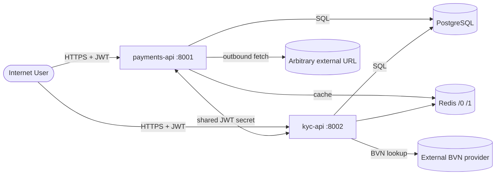

# SentinelPay — Day 2: STRIDE Threat Model

**Engineer:** Charles (asochi07) · **Date:** 15 June 2026 · **Deliverable:** D-01 (source)

## 1. Method

The model walks each of the four trust boundaries identified on Day 1 and applies all
six STRIDE categories (Spoofing, Tampering, Repudiation, Information disclosure, Denial
of service, Elevation of privilege) at each boundary. Threats are linked to concrete
findings from the Day 2 scanning pass (Bandit, Semgrep, Gitleaks) and from manual review
/ logic analysis. Risk = Likelihood (L/M/H) x Impact (L/M/H).

## 2. Assets & actors

**Assets:** wallet balances; KYC PII (BVN/NIN, uploaded documents); user credentials;
JWT signing secret; transaction records; AWS credentials present in the environment.

**Actors:** anonymous internet user; authenticated low-privilege user; admin user;
compromised-service actor (the two services trust each other's tokens).

## 3. Data flow diagram

## 4. Threat register

### Boundary 1 — Internet -> API

| TM-ID | STRIDE | Threat | Source | Risk |
|-------|--------|--------|--------|------|
| TM-01 | S | Forge a JWT using the `none` algorithm / unsigned token to impersonate any user | Broken JWT (`auth.py`) | Critical |
| TM-02 | T | Inject SQL via search/lookup params to read or alter DB contents | SQLi (`transactions.py`, `verify.py`) | Critical |
| TM-03 | R | Money-moving actions are not audit-logged; a user can deny performing them | Missing audit logging (logic) | High |
| TM-04 | I | Debug mode and verbose errors leak stack traces and internals | Debug mode (`main.py`) | Medium |
| TM-05 | D | No rate limiting on login/register/otp enables credential stuffing and OTP flooding | Missing rate limiting (logic) | High |
| TM-06 | E | Forged JWT with `"role":"admin"` reaches `/v1/admin/*` | Broken JWT + admin routes | Critical |

### Boundary 2 — API -> PostgreSQL

| TM-ID | STRIDE | Threat | Source | Risk |
|-------|--------|--------|--------|------|
| TM-07 | I | SQLi / over-broad queries expose PII (BVN/NIN, KYC docs) and balances | SQLi consequence; data at rest | Critical |
| TM-08 | S/E | Default DB credentials hardcoded in `db.py`; direct DB connection possible | Hardcoded default creds | High |
| TM-09 | T/E | IDOR — `get_account` / `fetch_doc` trust supplied ID with no ownership check | IDOR (logic) | High |
| TM-10 | T | Mass assignment — `update_profile` writes arbitrary columns from request body | Mass assignment (logic) | High |
| TM-11 | T | Wallet race condition — concurrent debits double-spend (no locking) | Race condition (logic) | High |
| TM-12 | I | Weak MD5 hashing — DB compromise yields trivially crackable password hashes | MD5 (`auth.py`) | High |

### Boundary 3 — API -> arbitrary external URL

| TM-ID | STRIDE | Threat | Source | Risk |
|-------|--------|--------|--------|------|
| TM-13 | I/E | SSRF in `webhooks/test` fetches any URL incl. cloud metadata (169.254.169.254) -> IAM cred theft once on AWS | SSRF (logic) | Critical (cloud) |
| TM-14 | I | SSRF variant via KYC BVN provider URL -> internal network probing | SSRF variant (logic) | High |
| TM-15 | D | Attacker URL with no redirect cap can hang / exhaust the worker | SSRF-adjacent | Medium |

### Boundary 4 — Service <-> service & privileged paths

| TM-ID | STRIDE | Threat | Source | Risk |
|-------|--------|--------|--------|------|
| TM-16 | S/E | Identical `JWT_SECRET` in both services -> token reuse / lateral movement | Shared secret | High |
| TM-17 | E | Insecure deserialisation — `pickle.loads` on user blob in `admin/session/restore` -> RCE | Pickle (`admin.py`) | Critical |
| TM-18 | S | Predictable OTP from `random.randint` -> step-up auth bypass | Weak randomness | Medium |
| TM-19 | E | Containers run as root -> amplified impact of any in-container compromise | Containers as root | Medium (infra) |

## 5. Coverage note — what scanners could not find

SAST (Bandit, Semgrep) caught pattern-based flaws: SQLi, MD5, pickle, broken JWT, debug
mode, root containers. The following were found only through the threat model / manual
review because they are authorization or business-logic flaws no scanner detects:
IDOR (TM-09), mass assignment (TM-10), wallet race condition (TM-11), SSRF reachability
(TM-13/14), missing rate limiting (TM-05), missing audit logging (TM-03).

## 6. VULN_INDEX reconciliation (integrity)

Inventory was frozen before consulting `VULN_INDEX.md`. On reconciliation, all 11 V-APP
identifiers were matched with no misses; no finding required a "found via hint" tag.
Three additional findings (hardcoded secrets, shared JWT secret, root containers) were
surfaced ahead of their V-CLD / V-PIP phase and will be formally tracked under those
identifiers later. `VULN_INDEX.md` was first opened during the Day 1 documentation
review; the Day 2 inventory was nonetheless derived independently and only checked
against the index afterwards.
